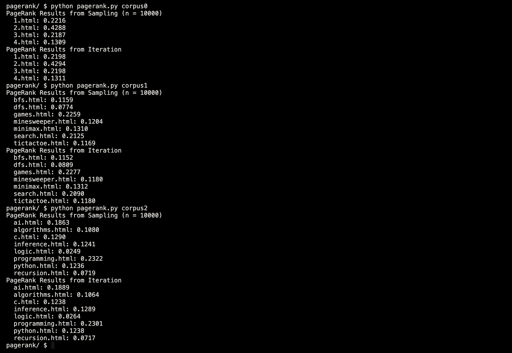

# 🔍 PageRank AI



This project builds an **AI agent** that computes the **PageRank** of web pages using two distinct approaches:

1. 🎲 **Sampling-based approximation** (Monte Carlo method)
2. 🔢 **Iterative deterministic calculation** (converging to mathematical equilibrium)

Inspired by the original **Google PageRank algorithm**, this AI determines how important a web page is based purely on the link structure of the web.

---

## 📚 Table of Contents

- [🧠 Project Overview](#-project-overview)
- [🔢 How PageRank Works](#-how-pagerank-works)
- [✨ Algorithm Architecture](#-algorithm-architecture)
- [🛠️ Features](#-features)
- [🧪 AI Concepts Applied](#-ai-concepts-applied)
- [📁 Project Structure](#-project-structure)
- [🚀 Getting Started](#-getting-started)

---

## 🧠 Project Overview

This project replicates the core principles behind Google's famous **PageRank algorithm** — an algorithm that revolutionized how search engines measure web page importance.

The AI analyzes a collection of HTML pages (a **corpus**) and computes PageRank using two approaches:

- **Sampling**: A random surfer navigates the web, moving from page to page based on a probability model.
- **Iteration**: A mathematical process updates page ranks repeatedly until the values converge.

---

## 🔢 How PageRank Works

The basic idea:

> 📈 A page is considered important if **other important pages link to it**.

- The more pages link to a page, the higher its rank.  
- Links from **important pages weigh more** than links from unimportant ones.  
- The **random surfer model** assumes that with some probability, a user follows links, and with some probability, they jump to any random page.

---

### ✨ Algorithm Architecture

This project implements:

- 🧠 **Transition Model**:  
  Computes the probability distribution over which page the surfer visits next.

- 🎲 **Sampling-based PageRank**:  
  Uses Monte Carlo simulations where a surfer makes `n` random walks to estimate PageRank.

- 🔢 **Iterative PageRank**:  
  Mathematically updates page ranks based on the PageRank formula until the values stabilize (convergence threshold `< 0.001`).

- ♻️ **Dead End Handling**:  
  Pages with no links are treated as if they link to all pages in the corpus.

---

## 🛠️ Features

- ✅ Compute PageRank via **sampling** (approximation)  
- ✅ Compute PageRank via **iteration** (deterministic)  
- ✅ Handles pages with **no outgoing links** (dead ends)  
- ✅ Handles **disconnected pages** in the corpus  
- ✅ Fully self-contained corpus parsing from local HTML files  
- ✅ Clear output showing the ranking of pages via both methods

---

## 🧪 AI Concepts Applied

| Concept                      | Description                                                  |
|------------------------------|--------------------------------------------------------------|
| **Probabilistic Models**     | Simulates web navigation using probabilities (random surfer) |
| **Monte Carlo Simulation**   | Estimates ranks through random sampling                      |
| **Iterative Convergence**    | Updates ranks until numerical stability                      |
| **Markov Chains**            | Models state transitions based on link structure             |
| **Dead End Handling**        | Correctly models pages with no outgoing links                |

---

## 📁 Project Structure

| File               | Description                                        |
|--------------------|----------------------------------------------------|
| `pagerank.py`      | Main AI logic for sampling and iterative PageRank  |
| `corpus/`          | Example HTML files used for PageRank computation   |
| `README.md`        | Project documentation                              |

---

## 🚀 Getting Started

Set up the project on your machine and compute PageRank from any corpus of HTML files.

### 1. Clone the Repository

```bash
git clone https://github.com/RichardPinheiro/pagerank-ai.git
cd pagerank-ai
```

### 2. Create a Virtual Environment (Recommended)

```bash
python3 -m venv .venv
```

### 3. Activate the Virtual Environment

```bash
source .venv/bin/activate
```
On Windows, use:
```bash
.venv\Scripts\activate
```

### 4. Install Dependencies

```bash
pip install -r requirements.txt
```

### 5. Run PageRank

```bash
python3 pagerank.py corpus0
```
```bash
python3 pagerank.py corpus1
```
```bash
python3 pagerank.py corpus2
```